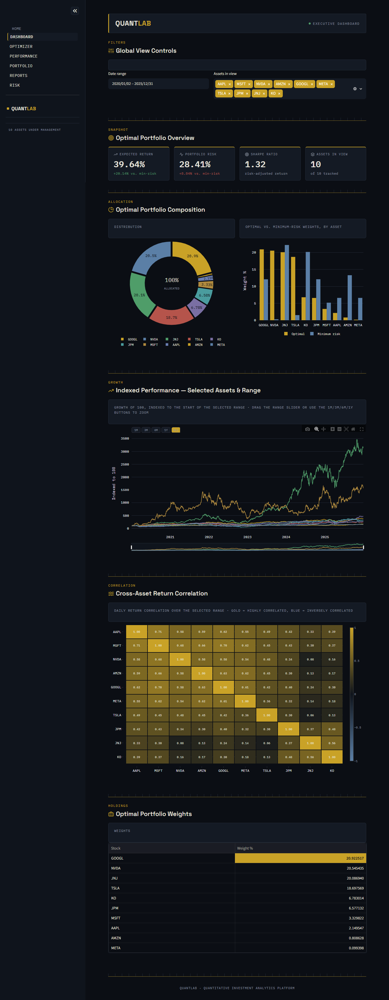
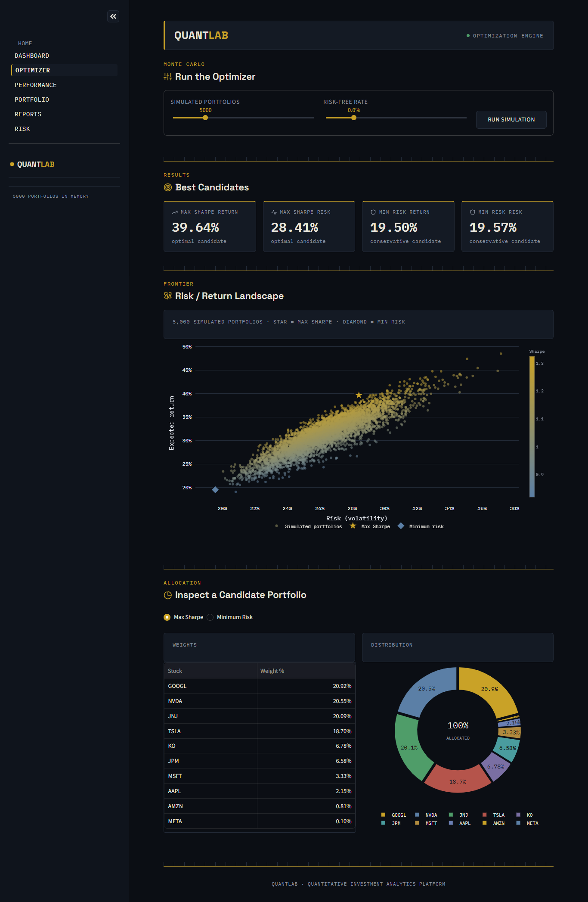
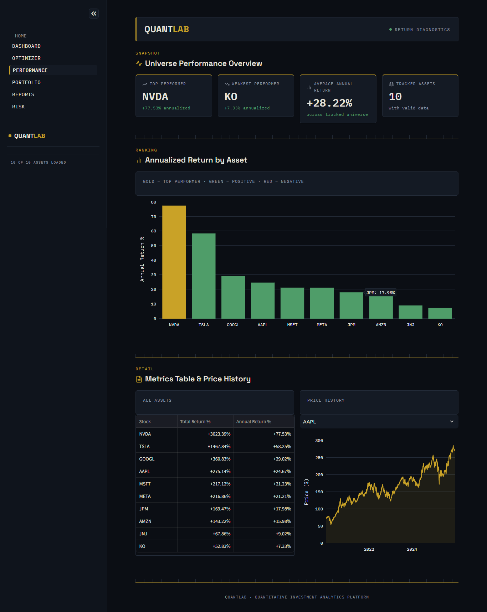
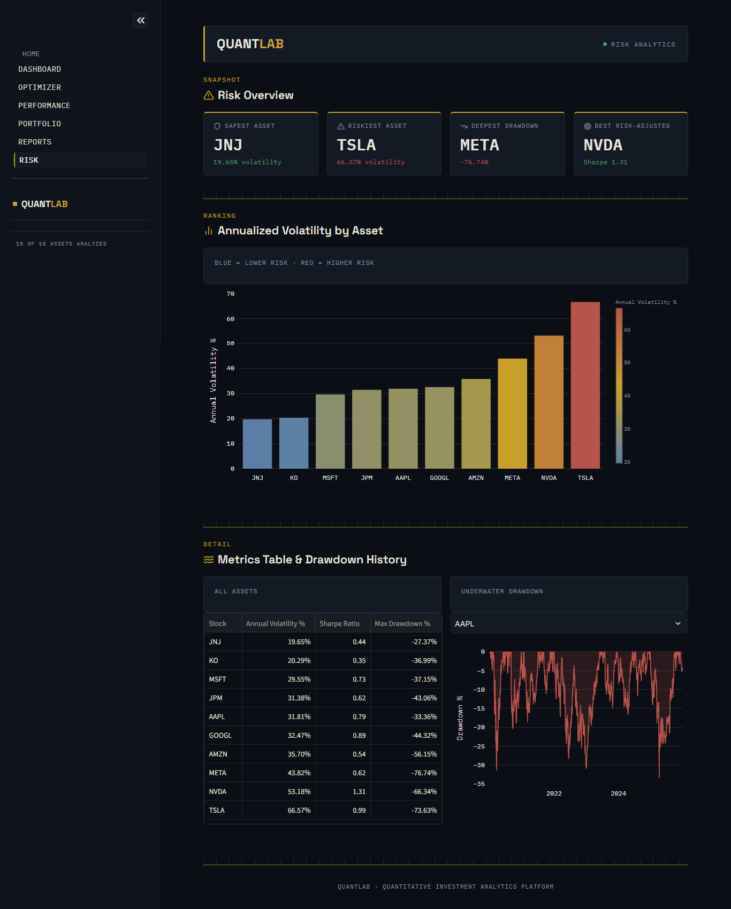
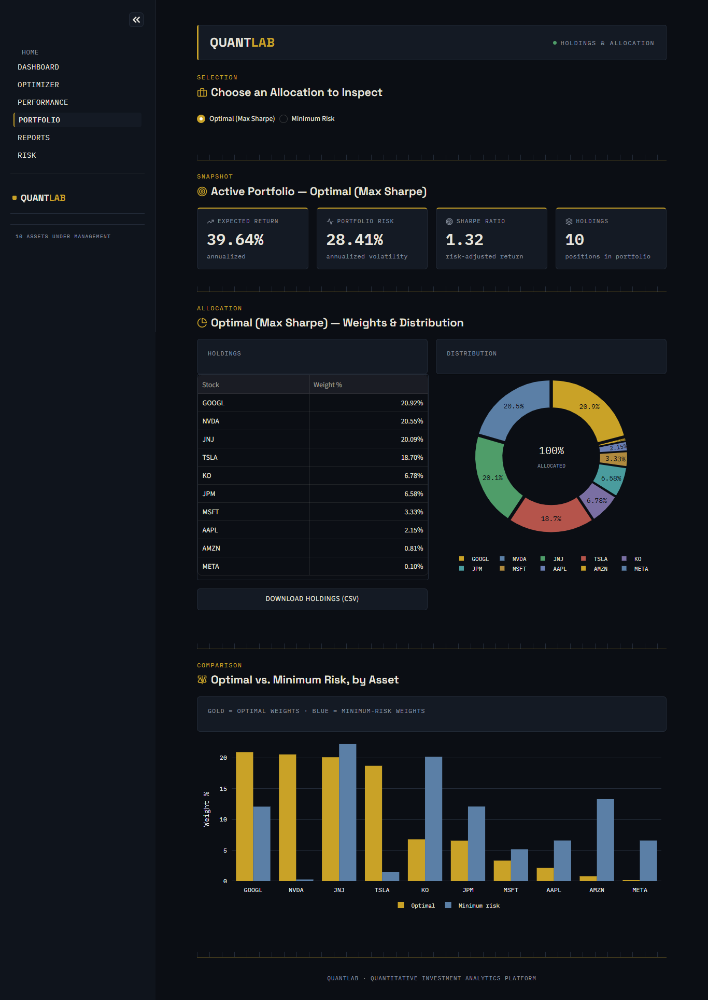
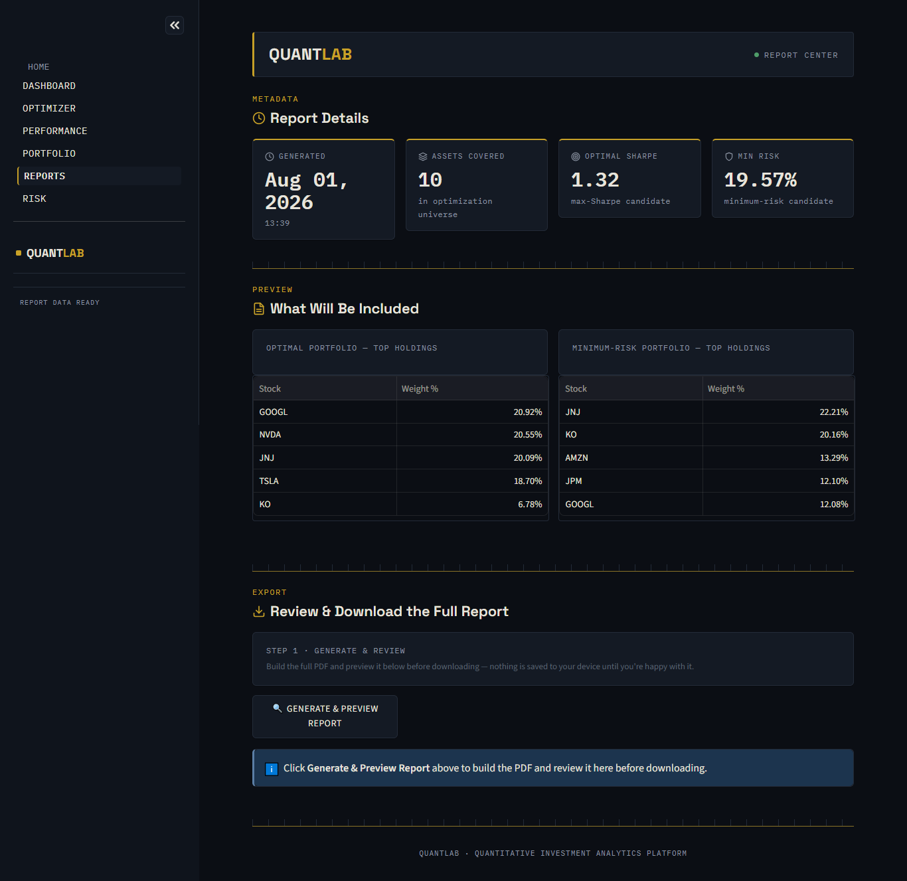

# 📈 QuantLab — Quantitative Investment Analytics Platform

QuantLab is an interactive quantitative analytics and portfolio optimization platform built using Modern Portfolio Theory (MPT) and Monte Carlo simulations. It bridges mathematical finance with clean visualizations, enabling real-time risk/return landscape mapping and automated institutional reporting.

---

## 📸 Platform Previews

### 📊 Dashboard


### 🎯 Portfolio Optimizer (Monte Carlo Efficient Frontier)


### 📈 Performance & Risk Analytics
| Performance Overview | Risk Analytics & Heatmap |
| :---: | :---: |
|  |  |

### 💼 Portfolio Weights & PDF Reports
| Portfolio Allocation | Institutional PDF Report |
| :---: | :---: |
|  |  |

---

## ✨ Key Features

* **Monte Carlo Optimization Engine:** Simulates 5,000+ candidate portfolio allocations across multi-asset universes.
* **Efficient Frontier Mapping:** Visually identifies Maximum Sharpe Ratio and Minimum Risk portfolios.
* **Risk & Performance Analytics:** Tracks annualized returns, volatility, Sharpe ratio, max drawdown, and cross-asset correlation heatmaps.
* **Automated PDF Export:** Generates downloadable, institutional-grade summary reports on demand.

---

## 💡 Key Analytical Insights

* **Max Sharpe Portfolio (Sharpe 1.32 | Return 39.64%):** Concentrates ~80% of total capital into high-alpha growth drivers (`$GOOGL`, `$NVDA`, `$JNJ`, `$TSLA`).
* **Minimum Risk Portfolio (Volatility 19.57% | Return 19.50%):** Slashes high-beta assets (`$NVDA` drops from 20.55% → 0.28%) and rotates heavily into defensive staples (`$JNJ`, `$KO`, `$AMZN`).

---

## 🛠️ Tech Stack

* **Language:** Python 3.x
* **Data & Analytics:** Pandas, NumPy, SciPy
* **Visualization:** Plotly, Streamlit
* **Database:** MySQL
* **Reporting Engine:** ReportLab / PDF Engine

---

## 🚀 Quick Start & Installation

1. **Clone the Repository:**
   ```bash
   git clone [https://github.com/sujalmore21/QuantLab-Financial-Analytics.git](https://github.com/sujalmore21/QuantLab-Financial-Analytics.git)
   cd QuantLab-Financial-Analytics